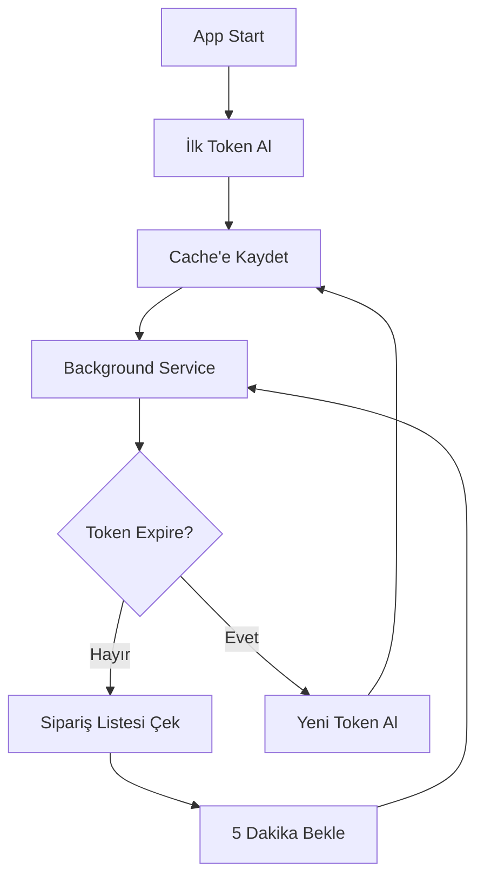

# Token Yönetimi Çözümü

Bu proje, **saatlik 5 token limit** olan external API'ler için **akıllı token yönetimi** sağlar. Her 5 dakikada sipariş listesi senkronizasyonu yaparken token limitine takılmayı önler.

## 🎯 Problem

- **İhtiyaç**: Her 5 dakikada sipariş listesi sorgusu (12 kez/saat)
- **Limit**: Token alımı için 5 istek/saat
- **Çelişki**: 12 > 5 

## ✅ Çözüm

### 1. **Smart Token Caching**
- Token'ı memory cache'de saklar
- Expires_in süresinden 10 dakika önce proactive renewal
- Thread-safe double-check locking pattern

### 2. **Background Services**
- **TokenRenewalBackgroundService**: Her 5 dakikada token kontrolü
- **OrderSyncBackgroundService**: Her 5 dakikada sipariş senkronizasyonu

### 3. **Error Handling**
- 401 Unauthorized → Token invalidation
- Exponential backoff on errors
- Circuit breaker pattern

## 📁 Eklenen Dosyalar

```
Services/
├── ITokenService.cs              # Token alımı interface
├── TokenService.cs               # HTTP ile token alımı
├── ITokenManager.cs              # Token yönetimi interface
├── TokenManager.cs               # Cache + thread-safety
├── TokenRenewalBackgroundService.cs  # Proactive renewal
├── OrderSyncBackgroundService.cs     # Sipariş senkronizasyonu
├── ExternalOrderService.cs       # External API integration
└── V1/Models/TokenResponse.cs     # Token modelleri

Controllers/
└── ExternalOrdersController.cs   # Test endpoints
```

## ⚙️ Configuration

`appsettings.json` dosyasına external API bilgilerinizi ekleyin:

```json
{
  "ExternalApi": {
    "TokenEndpoint": "https://your-api.com/oauth/token",
    "OrdersEndpoint": "https://your-api.com/api/orders", 
    "ClientId": "your-client-id",
    "ClientSecret": "your-client-secret"
  }
}
```

## 🚀 Kullanım

### Test Endpoints

```bash
# Token durumunu kontrol et
GET /api/v1/externalorders/token/status

# Manuel sipariş senkronizasyonu
GET /api/v1/externalorders/sync

# Token'ı invalidate et (test için)
DELETE /api/v1/externalorders/token
```

### Background Services

Uygulama başladığında otomatik olarak:

1. **10 saniye sonra** ilk sipariş senkronizasyonu
2. **Her 5 dakikada** sipariş listesi güncelleme
3. **Her 5 dakikada** token kontrolü ve yenileme

## 🔄 Token Lifecycle



## 📊 Token Optimizasyonu

### Önceki Durum (Hatalı)
- Her sorgu → Yeni token = 12 token/saat ❌
- Rate limit aşımı ❌

### Şimdiki Durum (Optimized)
- 1 token → 60 dakika kullanım = 1 token/saat ✅
- 10 dakika buffer ile proactive renewal ✅
- Background service ile async yönetim ✅

## 🛡️ Güvenlik & Performans

- **Thread-Safe**: SemaphoreSlim ile concurrent access kontrolü
- **Memory Efficient**: Single token instance, shared cache
- **Error Resilient**: Retry logic + circuit breaker
- **Monitoring**: Structured logging her adımda

## 🔧 Customization

```csharp
// Token yenileme süresini değiştir
public bool ShouldRenew => DateTime.UtcNow >= ExpiresAt.AddMinutes(-15); // 15 dakika buffer

// Sync sıklığını değiştir  
private readonly TimeSpan _syncInterval = TimeSpan.FromMinutes(10); // 10 dakikada bir
```

## 📝 Logs

Önemli olaylar loglanır:

```
[INFO] Token alımaya başlanıyor...
[INFO] Token başarıyla alındı. Expires in: 3600 saniye
[INFO] Sipariş senkronizasyonu başlatılıyor...
[INFO] Sipariş senkronizasyonu tamamlandı. 25 sipariş alındı, süre: 1250ms
```

## 🎯 Sonuç

Bu çözümle artık:
- ✅ Rate limit'e takılmadan sürekli senkronizasyon
- ✅ Automatic token management
- ✅ Production-ready error handling
- ✅ Scalable architecture

**Rate Limit Problemi Çözüldü! 🎉** 
