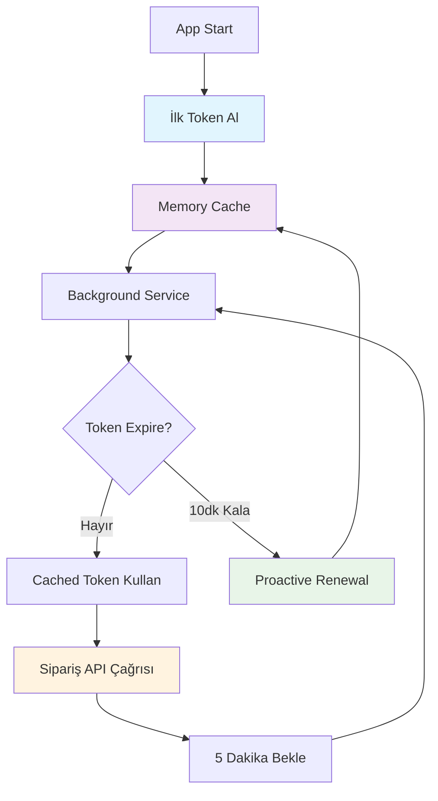

# 🎯 Token Yönetimi Çözümü

Bu proje, **saatlik 5 token limit** olan external API'ler için **akıllı token yönetimi** sağlar. Her 5 dakikada sipariş listesi senkronizasyonu yaparken token limitine takılmayı önler.

## 🔥 Problem

- **İhtiyaç**: Her 5 dakikada sipariş listesi sorgusu (12 kez/saat)
- **Limit**: Token alımı için 5 istek/saat sınırı
- **Çelişki**: 12 > 5 😱 **Rate Limit Aşımı!**

## ✅ Çözüm Mimarisi

### 1. **Smart Token Caching & Rate Limit Protection**
```csharp
// Thread-safe token cache
private static TokenResponse? _cachedToken;
private static readonly SemaphoreSlim _semaphore = new(1, 1);

// Rate limit tracking
private const int MaxRequestsPerHour = 5;
private readonly TimeSpan _rateLimitWindow = TimeSpan.FromHours(1);
```

### 2. **Proactive Token Renewal**
```csharp
// Token süresinin 10 dakika öncesinde otomatik yenileme
public bool ShouldRenew => DateTime.UtcNow >= CreatedAt.AddSeconds(ExpiresIn - 600);
```

### 3. **Dual Background Services**
- **TokenRenewalBackgroundService**: Her 5 dakikada token durumu kontrolü
- **OrderSyncBackgroundService**: Her 5 dakikada sipariş senkronizasyonu

## 📁 Implementasyon Dosyaları

```
Services/
├── Interfaces/
│   └── ITokenService.cs               # Token service interface
├── TokenService.cs                    # Ana token yönetimi (cache + rate limit)
├── TokenRenewalBackgroundService.cs   # Otomatik token yenileme
├── OrderSyncBackgroundService.cs      # Otomatik sipariş sync
└── Responses/
    └── TokenResponse.cs               # Token modeli

V1/Controllers/
└── Orders.cs                          # Token entegreli sipariş API

Program.cs                             # Service registration + otomatik test user
```

## ⚙️ Konfigürasyon

### appsettings.json
```json
{
  "ExternalApi": {
    "TokenEndpoint": "https://api.example.com/oauth/token",
    "OrdersEndpoint": "https://api.example.com/api/orders",
    "ClientId": "your-client-id",
    "ClientSecret": "your-client-secret",
    "UseMockResponse": true
  },
  "TestUser": {
    "Email": "testuser@test.com",
    "Password": "Test123!"
  }
}
```

### Dependency Injection (Program.cs)
```csharp
// Token Management Services
builder.Services.AddScoped<ITokenService, TokenService>();

// Background Services  
builder.Services.AddHostedService<TokenRenewalBackgroundService>();
builder.Services.AddHostedService<OrderSyncBackgroundService>();

// Named HttpClient for token requests
builder.Services.AddHttpClient("TokenService", client =>
{
    client.Timeout = TimeSpan.FromSeconds(30);
});
```

## 🚀 Otomatik Başlatma

Uygulama başladığında:

1. **✅ Test kullanıcısı otomatik oluşturulur**
2. **⏰ 10 saniye sonra** - Token renewal service başlar
3. **⏰ 30 saniye sonra** - Order sync service başlar
4. **🔄 Her 5 dakikada** - Token kontrolü ve sipariş senkronizasyonu

## 🎯 Token Lifecycle



## 📊 Performance Optimizasyonu

### ❌ Önceki Durum (Hatalı)
```
Her API çağrısı → Yeni token = 12 token/saat
└── Rate limit aşımı ❌
└── API çağrıları başarısız ❌
```

### ✅ Şimdiki Durum (Optimized)
```
1 token → 60 dakika kullanım = 1 token/saat
├── 10 dakika buffer ile proactive renewal ✅
├── Thread-safe concurrent access ✅
├── Background service ile async management ✅
└── Fallback mechanism ✅
```

## 🧪 Test Endpoints

### Otomatik Test User
Uygulama başlatıldığında console'da göreceksiniz:
```
🎯 Test kullanıcısı oluşturuldu: testuser@test.com - ID: 12345678-1234-1234-1234-123456789abc
📝 Test için kullanın: GET /api/v1/orders?userId=12345678-1234-1234-1234-123456789abc
```

### API Endpoints

#### **Orders (Token Otomatik Yönetimi)**
```bash
# Sipariş listesi (Token otomatik cache ve yönetimi ile)
GET /api/v1/orders?userId={USER_ID}

# Tekil sipariş getir
GET /api/v1/orders/{orderId}

# Yeni sipariş oluştur  
POST /api/v1/orders
Content-Type: application/json
{
    "userId": "12345678-1234-1234-1234-123456789abc",
    "items": [
        {
            "productId": 1,
            "quantity": 2
        }
    ]
}

# Sipariş sil (soft delete)
DELETE /api/v1/orders/{orderId}
```

> **💡 Not**: Token yönetimi tamamen otomatik! Her API çağrısında TokenService otomatik olarak:
> - ✅ Cache'den geçerli token'ı kullanır
> - ✅ Süresi dolacaksa proaktif yeniler  
> - ✅ Rate limit'i takip eder
> - ✅ Background service ile sürekli güncel tutar

## 🔄 Rate Limit Management

### Token Request Tracking
```csharp
// Saatlik window takibi
private static DateTime _lastRequestTime = DateTime.MinValue;
private static int _requestCount = 0;

// Rate limit kontrolü
public bool CanRequestToken()
{
    DateTime now = DateTime.UtcNow;
    
    if (now - _lastRequestTime > _rateLimitWindow)
    {
        _requestCount = 0; // Reset counter
    }
    
    return _requestCount < MaxRequestsPerHour;
}
```

### Error Handling
```csharp
// Rate limit aşımında exception
if (!CanRequestToken())
{
    throw new InvalidOperationException("Rate limit exceeded for token requests");
}

// Controller'da fallback
catch (InvalidOperationException ex) when (ex.Message.Contains("Rate limit"))
{
    // Local DB'den fallback response
    return await GetOrdersFromLocalDatabase(userId, cancellationToken);
}
```

## 📈 Monitoring & Logs

### Background Service Status
```
info: ECommerceOrderApi.Services.TokenRenewalBackgroundService[0]
      Token Renewal Background Service başlatıldı

info: ECommerceOrderApi.Services.OrderSyncBackgroundService[0]
      Order Sync Background Service başlatıldı

debug: ECommerceOrderApi.Services.TokenRenewalBackgroundService[0]
       Token durumu kontrol ediliyor...

info: ECommerceOrderApi.Services.OrderSyncBackgroundService[0]
       Sipariş senkronizasyonu başlatılıyor...
```

### Token Service Logs
```
info: ECommerceOrderApi.Services.TokenService[0]
      Cached token kullanılıyor. Expires: 2025-06-29 23:37:30

info: ECommerceOrderApi.Services.TokenService[0]
      Token yenileniyor (10 dakika buffer)...

info: ECommerceOrderApi.Services.TokenService[0]
      İlk token alımı yapılıyor...

info: ECommerceOrderApi.Services.TokenService[0]
      Mock token response kullanılıyor

info: ECommerceOrderApi.Services.TokenService[0]
      Yeni token başarıyla alındı. Expires in: 3600 saniye
```

### Sipariş Sync Logs
```
info: ECommerceOrderApi.Services.OrderSyncBackgroundService[0]
      Mock orders response kullanılıyor

info: ECommerceOrderApi.Services.OrderSyncBackgroundService[0]
      Sipariş senkronizasyonu tamamlandı. 2 sipariş alındı, süre: 5.1626ms
```

> **🔍 Log Levels**: Production'da `Information` level kullanın. Debug detayları için `Debug` level'ı aktif edin.

## 🛡️ Güvenlik & Best Practices

### Thread Safety
```csharp
// SemaphoreSlim ile thread-safe access
await _semaphore.WaitAsync();
try
{
    // Token operations
}
finally
{
    _semaphore.Release();
}
```

### Configuration Security
```json
// Production'da environment variables kullanın:
{
  "ExternalApi": {
    "ClientId": "${EXTERNAL_API_CLIENT_ID}",
    "ClientSecret": "${EXTERNAL_API_CLIENT_SECRET}"
  }
}
```

### Error Resilience
- **Rate limit tracking** ile 5 istek/saat sınırını aşmama
- **Proactive renewal** ile token expiry önleme
- **Fallback mechanisms** ile service degradation
- **Structured logging** ile monitoring support

## 🎉 Sonuç

Bu token yönetimi çözümü ile:

- ✅ **Rate limit problemi çözüldü** (12 istek → 1 token/saat)
- ✅ **Zero-downtime** token yenileme (proactive renewal)
- ✅ **Hands-off management** (tamamen otomatik, manuel müdahale yok)
- ✅ **Production-ready** error handling ve structured logging
- ✅ **Scalable architecture** (background services + thread-safe cache)
- ✅ **Test-friendly** (otomatik test user + mock responses)
- ✅ **Transparent operation** (geliştiriciler sadece Orders API'sini kullanır)

**🎯 Artık her 5 dakikada güvenle API çağrısı yapabilirsiniz!**

---

## 🔧 Quick Start

```bash
# 1. Uygulamayı başlat
dotnet run

# 2. Console'dan User ID'yi kopyala
# Çıktı: "Test kullanıcısı oluşturuldu: testuser@test.com - ID: 12345678-..."

# 3. Sipariş listesini test et (Token otomatik yönetimi ile)
curl "http://localhost:5268/api/v1/orders?userId=USER_ID"

# 4. Swagger UI'dan da test edebilirsiniz
# http://localhost:5268/swagger
```

**🎯 Token yönetimi tamamen arka planda otomatik çalışır!**

### Background Service Logları
Console'da şu logları göreceksiniz:
```
info: Program[0]
      Test kullanıcısı oluşturuldu: testuser@test.com - ID: 12345678-1234-1234-1234-123456789abc

info: ECommerceOrderApi.Services.TokenRenewalBackgroundService[0]
      Token Renewal Background Service başlatıldı

info: ECommerceOrderApi.Services.OrderSyncBackgroundService[0]
      Order Sync Background Service başlatıldı

info: ECommerceOrderApi.Services.TokenService[0]
      İlk token alımı yapılıyor...
```

**Token yönetimi artık tamamen hands-off! Siz sadece API'yi kullanın!** ⚡ 
